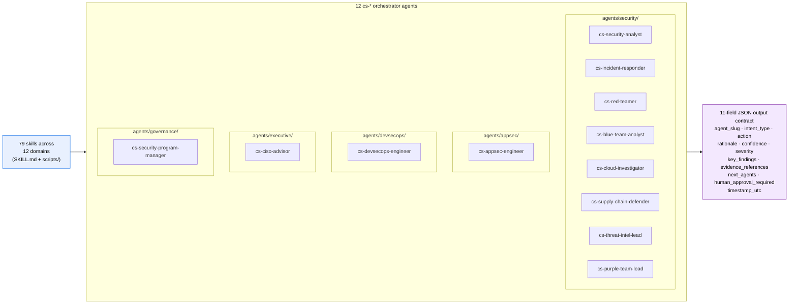
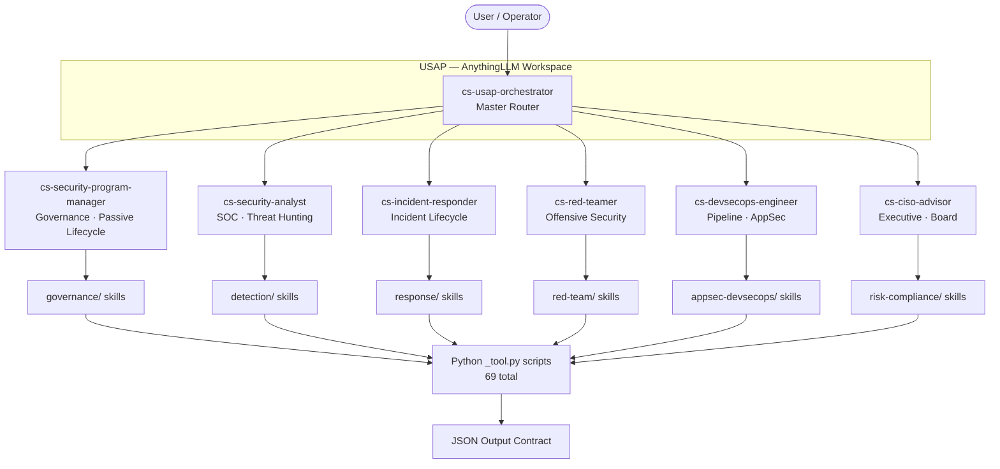

# USAP — Open-Source AI Cybersecurity Agent Skills

[](https://github.com/jaskaranhundal/usap-skills) [](https://github.com/jaskaranhundal/usap-skills/tree/main/agents) [](LICENSE) [](shared/scripts) [](https://github.com/jaskaranhundal/usap-skills/commits/main)

**Open-source cybersecurity skills library that turns any LLM into an auditable, portable security workflow runtime for SOC and AppSec teams.**

Each `SKILL.md` is a complete LLM system prompt — paste into Claude, ChatGPT, Gemini, Ollama, or AnythingLLM with no install. Apache 2.0, typed 11-field output contract, framework-mapped (MITRE ATT&CK, NIST CSF 2.0, OWASP Top 10, ATLAS, D3FEND, NIST AI RMF), L1–L4 autonomy with explicit human-approval gates.

---

## Architecture



Skills are stateless prompt + tool packages (`SKILL.md` + stdlib `scripts/`). Orchestrator agents compose them via the v2 agent contract (`standards/agent-contract.md`). Every output validates against the typed 11-field contract (`standards/output-contract.md`).

### What a real payload looks like

Every skill emits the same shape. Below is a fully-populated payload from one run of `vuln-scan` against the in-repo `SimpleStoreAPI` fixture — all 11 required fields plus the optional tail (`mitre_ttps`, `affected_assets`, `artifact_path`). Byte-identical to [`appsec-devsecops/vuln-scan/expected_outputs/sample_output.json`](appsec-devsecops/vuln-scan/expected_outputs/sample_output.json), validated against [`tools/output_contract.py`](tools/output_contract.py) in CI on every push.

```json
{
  "agent_slug": "vuln-scan",
  "intent_type": "detect",
  "action": "Hand off to finding-triage — 4 mapped findings, 1 unmapped, top severity high.",
  "rationale": "Scanned SimpleStoreAPI against TM-001..TM-005. Found 5 distinct findings after dedup: hardcoded credential (TM-001 proximity 9), SQL string concat (TM-002 proximity 8), public S3 ACL (TM-002 proximity 7), permissive CORS (unmapped), missing input validation on /api/v1/profile (TM-001 proximity 9). Confidence dampened 0.05 per merge.",
  "confidence": 0.82,
  "severity": "high",
  "key_findings": [
    "VF-001 hardcoded-credential at src/config.py:14 — mapped to TM-001, proximity 9",
    "VF-002 sql-string-concat at src/db/profile.js:42 — mapped to TM-002, proximity 8",
    "VF-003 public-iac at infra/storage.tf:21 — mapped to TM-002, proximity 7",
    "VF-004 missing-input-validation at src/routes/profile.js:11 — mapped to TM-001, proximity 9",
    "VF-005 permissive-cors at src/middleware/cors.js:6 — UNMAPPED (no top-5 threat covers this)"
  ],
  "evidence_references": [
    {"source": "scanner", "ref": "src/config.py:14", "quote": "PASSWORD = \"changeme-prod\""},
    {"source": "scanner", "ref": "src/db/profile.js:42", "quote": "db.query('SELECT * FROM users WHERE id = ' + req.params.id)"},
    {"source": "scanner", "ref": "infra/storage.tf:21", "quote": "acl = \"public-read\""}
  ],
  "next_agents": ["finding-triage"],
  "human_approval_required": false,
  "timestamp_utc": "2026-06-20T10:30:00Z",
  "mitre_ttps": ["T1552.001", "T1190"],
  "affected_assets": ["SimpleStoreAPI"],
  "artifact_path": "/tmp/simple-store-api/VULN-FINDINGS.json"
}
```

The 11 required fields are: `agent_slug`, `intent_type`, `action`, `rationale`, `confidence`, `severity`, `key_findings`, `evidence_references`, `next_agents`, `human_approval_required`, `timestamp_utc`. Optional extras after that. The CI gate fails any committed sample that drops a required field.


## Why USAP

- **Open source, no SaaS, no waitlist.** Apache 2.0. Drop the skills into Claude, ChatGPT, Gemini, Ollama, or AnythingLLM with no platform install. No vendor cloud, no per-seat pricing, no telemetry leaving your environment.
- **Standardized 11-field output contract.** Every skill emits CVSS, MITRE ATT&CK technique IDs, evidence references, and an explicit `human_approval_required` flag (`standards/output-contract.md`). Safe to embed in production agent stacks where competitor copilots remain black boxes.
- **`cs-*` orchestrator agents.** 12 named agents (`cs-security-analyst`, `cs-incident-responder`, `cs-blue-team-analyst`, `cs-red-teamer`, `cs-cloud-investigator`, `cs-supply-chain-defender`, `cs-threat-intel-lead`, `cs-purple-team-lead`, `cs-appsec-engineer`, `cs-devsecops-engineer`, `cs-ciso-advisor`, `cs-security-program-manager`) compose the skills into reproducible workflows.
- **Framework-mapped at the metadata layer.** `metadata.frameworks.{mitre_attack, nist_csf, mitre_atlas, owasp_top10, d3fend, nist_ai_rmf}` arrays drive auto-generated ATT&CK Navigator and NIST CSF coverage docs in `mappings/` — never hand-maintained.
- **L1–L4 autonomy model.** Mutating intents (key rotation, isolation, account disablement) carry explicit `human_approval_required: true` gates. Predictable behaviour at every level.
- **[agentskills.io spec-conformant](https://agentskills.io/specification).** Every USAP `SKILL.md` validates against the open standard (verified on 2026-06-20). Drop USAP into any agentskills.io-compatible client — Claude Code, Cursor, Goose, OpenCode, GitHub Copilot, Gemini CLI, OpenAI Codex CLI, and 30+ others.

## Who is this for

USAP is built for three teams that already own LLM access and don't want to rent another SaaS:

- **SOC and detection engineering teams (50–500-person security orgs)** running Splunk / Sentinel + EDR who want a vetted, MITRE-mapped skills library to amplify analyst output. Activate `cs-security-analyst` for any alert; cascade to `cs-blue-team-analyst`, `cs-threat-intel-lead`, or `cs-incident-responder`.
- **DevSecOps and platform-security engineers** at engineering-led orgs who use Claude Code or similar. Embed `cs-devsecops-engineer` and `cs-appsec-engineer` in CI; route runtime findings into `webapp-security/`.
- **MSSPs, security consultancies, and red teamers** who need client-ready CVSS / MITRE / evidence-tagged deliverables. White-label the skills, embed in your own delivery stack, ship.

---


## Demo: an end-to-end run


A real run of `cs-appsec-engineer` against the in-repo `SimpleStoreAPI` fixture. The animation above and the transcript below show the same data — every line of JSON is byte-identical to [`appsec-devsecops/vuln-scan/expected_outputs/sample_output.json`](appsec-devsecops/vuln-scan/expected_outputs/sample_output.json). Regenerate the animation with `python3 tools/gen_demo_svg.py`.

**You:** Scan `examples/SimpleStoreAPI` for vulnerabilities and route any high findings to triage.

**`cs-appsec-engineer`:** Running `vuln-scan` against threat model TM-001..TM-005.

```bash
$ python3 appsec-devsecops/vuln-scan/scripts/vuln-scan_tool.py \
    --input examples/SimpleStoreAPI/scan-context.json --output json
```

```json
{
  "agent_slug": "vuln-scan",
  "intent_type": "detect",
  "action": "Hand off to finding-triage — 4 mapped findings, 1 unmapped, top severity high.",
  "rationale": "Scanned SimpleStoreAPI against TM-001..TM-005. Found 5 distinct findings after dedup: hardcoded credential (TM-001 proximity 9), SQL string concat (TM-002 proximity 8), public S3 ACL (TM-002 proximity 7), permissive CORS (unmapped), missing input validation on /api/v1/profile (TM-001 proximity 9). Confidence dampened 0.05 per merge.",
  "confidence": 0.82,
  "severity": "high",
  "key_findings": [
    "VF-001 hardcoded-credential at src/config.py:14 — mapped to TM-001, proximity 9",
    "VF-002 sql-string-concat at src/db/profile.js:42 — mapped to TM-002, proximity 8",
    "VF-003 public-iac at infra/storage.tf:21 — mapped to TM-002, proximity 7",
    "VF-004 missing-input-validation at src/routes/profile.js:11 — mapped to TM-001, proximity 9",
    "VF-005 permissive-cors at src/middleware/cors.js:6 — UNMAPPED (no top-5 threat covers this)"
  ],
  "evidence_references": [
    {"source": "scanner", "ref": "src/config.py:14", "quote": "PASSWORD = \"changeme-prod\""},
    {"source": "scanner", "ref": "src/db/profile.js:42", "quote": "db.query('SELECT * FROM users WHERE id = ' + req.params.id)"},
    {"source": "scanner", "ref": "infra/storage.tf:21", "quote": "acl = \"public-read\""}
  ],
  "next_agents": ["finding-triage"],
  "human_approval_required": false,
  "timestamp_utc": "2026-06-20T10:30:00Z"
}
```

**`cs-appsec-engineer`:** Severity is `high`, `next_agents` points at `finding-triage`. Handing off.

**Synthesis (operator-facing):**
> Five findings, four mapped to your threat model. The hardcoded production credential (`src/config.py:14`) and the SQL string concatenation on the profile route are both proximity-9 hits against TM-001 — patch first. The public S3 bucket ACL is a separate proximity-7 TM-002 hit. The permissive CORS rule is unmapped, which usually means your threat model is incomplete — recommend revisiting TM coverage. No mutating actions taken; `human_approval_required` was false because this was a read-only detect.

Try it yourself:

```bash
python3 appsec-devsecops/vuln-scan/scripts/vuln-scan_tool.py --output json | jq .
python3 tools/output_contract.py appsec-devsecops/vuln-scan/expected_outputs/sample_output.json
```

## Proof: every claim is a file in this repo

| Claim | Evidence |
|---|---|
| Typed 11-field output contract | [`standards/output-contract.md`](standards/output-contract.md) + [`tools/output_contract.py`](tools/output_contract.py) validator |
| Every skill emits a real payload | [`appsec-devsecops/vuln-scan/expected_outputs/sample_output.json`](appsec-devsecops/vuln-scan/expected_outputs/sample_output.json) (one of 79) |
| MITRE ATT&CK Navigator layer is auto-generated | [`mappings/mitre-attack/attack-navigator-layer.json`](mappings/mitre-attack/attack-navigator-layer.json) regenerated by [`tools/framework_extractor.py`](tools/framework_extractor.py); CI fails on drift |
| NIST CSF 2.0 coverage doc is auto-generated | [`mappings/nist-csf/csf-alignment.md`](mappings/nist-csf/csf-alignment.md) |
| MITRE ATT&CK coverage doc | [`mappings/mitre-attack/coverage-summary.md`](mappings/mitre-attack/coverage-summary.md) — 13 distinct techniques cited so far; 10 of the 79 skills carry `metadata.frameworks.mitre_attack` arrays (backfill is ongoing) |
| L1-L4 autonomy + `human_approval_required` gate | [`standards/level-guide.md`](standards/level-guide.md) + [`tools/validate_invocation_control.py`](tools/validate_invocation_control.py) strict CI gate |
| agentskills.io spec conformance | [`standards/frontmatter-spec.md`](standards/frontmatter-spec.md) + [`tools/validate_skill.py`](tools/validate_skill.py) on every push |

### ATT&CK Navigator layer (excerpt)

The full layer at [`mappings/mitre-attack/attack-navigator-layer.json`](mappings/mitre-attack/attack-navigator-layer.json) opens directly in [MITRE's Navigator](https://mitre-attack.github.io/attack-navigator/). Excerpt of the first two techniques:

```json
{
  "name": "USAP MITRE ATT&CK Coverage",
  "versions": {
    "attack": "16",
    "navigator": "4.9.5",
    "layer": "4.5"
  },
  "domain": "enterprise-attack",
  "techniques": [
    {
      "techniqueID": "T1041",
      "score": 1,
      "color": "",
      "comment": "USAP skills covering: detection/threat-intelligence",
      "enabled": true,
      "metadata": [],
      "links": [],
      "showSubtechniques": true
    },
    {
      "techniqueID": "T1046",
      "score": 1,
      "color": "",
      "comment": "USAP skills covering: detection/threat-hunting",
      "enabled": true,
      "metadata": [],
      "links": [],
      "showSubtechniques": true
    }
  ]
}
```

### NIST CSF 2.0 coverage (excerpt)

From [`mappings/nist-csf/csf-alignment.md`](mappings/nist-csf/csf-alignment.md):

| Subcategory | Skill count | Covering skills |
|---|---:|---|
| `DE.AE-02` | 3 | `detection/behavioral-analytics`, `detection/detection-engineering`, `detection/threat-hunting` |
| `DE.CM-01` | 2 | `detection/detection-engineering`, `detection/threat-hunting` |
| `ID.RA-05` | 1 | `detection/threat-intelligence` |

These tables are not hand-maintained. They are emitted by `tools/framework_extractor.py` from each skill's `metadata.frameworks.*` arrays. The CI pipeline fails any PR that ships a drift between the source frontmatter and the generated docs.


## Quick Start

> One agent. Any security question. Paste and go.

| Who you are | Paste this | Works on |
|---|---|---|
| Anyone — business owner, IT admin, or security engineer | `dist/USAP_LITE.md` | Claude, ChatGPT, Gemini, Ollama |
| Security team needing full orchestration across specialist agents | `dist/USAP_PRO.md` | Claude, ChatGPT, Gemini, Ollama |
| Security program with all 79 skills embedded | `dist/USAP_BUNDLE.md` | Claude, ChatGPT, Gemini |

Generate your kit:

```bash
python3 shared/scripts/bundle_usap.py bundle --mode lite   # → dist/USAP_LITE.md
python3 shared/scripts/bundle_usap.py bundle --mode pro    # → dist/USAP_PRO.md
python3 shared/scripts/bundle_usap.py bundle --mode full   # → dist/USAP_BUNDLE.md
```

### How Alex works

**Alex** (`cs-security-analyst`) is the single entry point for all three kits. You do not need to know which agent or skill to use — Alex figures that out.

- **Lite:** Alex answers directly from knowledge of all 79 USAP skills. Plain English by default; goes fully technical when you ask.
- **Pro / Full:** Alex detects multi-domain problems, activates party mode (`OR`), delegates to specialist agents (`cs-incident-responder`, `cs-ciso-advisor`, etc.), and synthesizes one unified answer.
- **Any LLM:** Paste the file as your system prompt. No install required.
- **Future:** MCP connectors will let Alex pull live cloud inventory, SIEM, and EDR data automatically. Until then, paste logs or describe your environment.

---

## Use with Gemini

Three ways — pick the one that fits your setup:

### Option 1: Google AI Studio (free, no code)
1. Go to [aistudio.google.com](https://aistudio.google.com)
2. Click **Create new prompt** → set type to **Chat**
3. Paste the contents of `dist/USAP_LITE.md` into the **System instructions** field
4. Start chatting with Alex

### Option 2: Gemini Gems (Gemini Advanced)
1. Go to [gemini.google.com](https://gemini.google.com) → **Gems** → **Create a Gem**
2. Name: `USAP Security Advisor`
3. Instructions: paste the contents of `dist/USAP_LITE.md`
4. Save and chat

### Option 3: Python script (Gemini API)

```bash
# Install the SDK
pip install google-generativeai

# Set your API key (get one free at aistudio.google.com)
export GEMINI_API_KEY="your-key-here"

# Start a chat session with Alex
python3 shared/scripts/gemini_chat.py --kit lite

# Use the pro kit (Alex + all 6 specialist agents)
python3 shared/scripts/gemini_chat.py --kit pro

# Use a different model
python3 shared/scripts/gemini_chat.py --kit lite --model gemini-1.5-pro
```

Kit size guide:

| Kit | Size | Recommended for |
|---|---|---|
| `lite` | 32 KB | Any Gemini model, free tier |
| `pro` | 121 KB | Gemini 1.5 Pro / 2.0 Flash |
| `full` | 684 KB | Gemini 1.5 Pro (2M context) |

---

## Use as CLI commands

USAP agents are registered as native slash commands in both Gemini CLI and Claude Code.

### Gemini CLI

```bash
npm install -g @google/gemini-cli
cd usap-skills
gemini          # GEMINI.md auto-loaded
/usap-alex      # Activate cs-security-analyst
```

### Claude Code

```bash
cd usap-skills
claude          # CLAUDE.md auto-loaded
/usap-alex      # Activate cs-security-analyst
```

### Available commands

| Command | Agent | Use for |
|---|---|---|
| `/usap-alex` | cs-security-analyst | Any security question — universal entry point |
| `/usap-incident-responder` | cs-incident-responder | Active incidents, forensics, containment |
| `/usap-red-teamer` | cs-red-teamer | Red team planning and offensive security |
| `/usap-devsecops` | cs-devsecops-engineer | Pipeline security, SAST/DAST, PR gates |
| `/usap-ciso` | cs-ciso-advisor | Board reports, risk posture, executive briefs |
| `/usap-program-manager` | cs-security-program-manager | Security roadmap and program planning |

---

## Which agent for which problem?

### Active incident in progress

| Situation | Start here | Then cascade to |
|---|---|---|
| Any new security event | `incident-classification` | Routes to the right specialist |
| Confirmed active incident, need command | `incident-commander` | `forensics`, `containment-advisor` |
| Need to contain an active threat | `containment-advisor` | MCP execution layer |
| Ransomware or destructive attack | `incident-commander` → `containment-advisor` | `forensics`, `compliance-mapping` |
| Forensic timeline and chain of custody | `forensics` | `threat-intelligence`, `compliance-mapping` |

### Credentials and identity

| Situation | Agent |
|---|---|
| Secret/API key found in code or logs | `secrets-exposure` |
| IAM anomaly, privilege escalation, root usage | `identity-access-risk` |
| Unusual user behavior, insider threat indicators | `behavioral-analytics` |
| Cryptographic key management risk | `cryptography-key-management` |

### Threats and hunting

| Situation | Agent |
|---|---|
| Hypothesis-driven threat hunt | `threat-hunting` |
| IOC enrichment and actor attribution | `threat-intelligence` |
| Anomaly or behavioral deviation | `behavioral-analytics` |
| Active network intrusion or lateral movement | `threat-hunting` → `incident-classification` |

### Vulnerabilities and patching

| Situation | Agent |
|---|---|
| CVE triage and prioritization | `vulnerability-management` |
| Zero-day, no patch available | `zero-day-response` |
| Code scanning (SAST/DAST) results | `sast-dast-coordinator` |
| IaC misconfiguration | `iac-security` |
| Cloud posture and drift | `cloud-security-posture` |
| Dependency and SBOM analysis | `supply-chain-risk` |

### Cloud and infrastructure

| Situation | Agent |
|---|---|
| AWS/Azure/GCP misconfiguration scan | `cloud-security-posture` |
| Public attack surface mapping | `attack-surface-management` |
| Network exposure and open ports | `network-exposure` |
| Endpoint and OS security | `endpoint-os-security` |
| OT/ICS/IoT device security | `ot-iot-device-security` |
| Build pipeline integrity | `build-integrity` |

### Detection and engineering

| Situation | Agent |
|---|---|
| Write a detection rule for a new TTP | `detection-engineering` |
| Assess telemetry data quality | `telemetry-signal-quality` |
| Continuous automated pentesting results | `continuous-pentesting` |
| AI/LLM agent integrity and prompt injection | `agent-integrity-monitor` |

### Architecture and design

| Situation | Agent |
|---|---|
| Threat model a new system or feature | `risk-threat-modeling` |
| Security architecture review | `security-architecture` |
| AI system ethics and governance | `ai-ethics-governance` |
| AI agent security assessment | `ai-agent-security` |

### Compliance and governance

| Situation | Agent |
|---|---|
| Map findings to compliance frameworks | `compliance-mapping` |
| Track regulatory horizon changes | `regulatory-horizon` |
| Internal audit and SOC 2 evidence | `internal-audit-assurance` |
| Privacy DPIA for a new feature | `privacy-dpia` |
| Security policy and control assessment | `security-policy-control` |
| Cyber insurance risk inputs | `cyber-insurance` |
| Quantum cryptography readiness | `quantum-security-readiness` |

### Supply chain and third parties

| Situation | Agent |
|---|---|
| Dependency and package risk | `supply-chain-risk` |
| Supply chain attack simulation | `supply-chain-simulation` |
| Vendor and third-party risk assessment | `third-party-vendor-risk` |

### Red team and adversary simulation

| Situation | Agent |
|---|---|
| Red team campaign planning | `red-team-planner` |
| Red team execution and Kill Chain | `red-team-operations` |
| Safe, scoped exploitation | `safe-exploitation` |
| Attack path analysis | `attack-path-analysis` |
| Security research and vulnerability discovery | `security-research` |

### Operations and reporting

| Situation | Agent |
|---|---|
| Track and triage security findings | `findings-tracker` |
| Security metrics and KPI reporting | `metrics-reporting` |
| Knowledge base and lessons learned | `knowledge-management` |
| Security awareness and training | `security-awareness` |
| Orchestrate a multi-agent workflow | `orchestrator` |

---

## Orchestrator Agents

7 `cs-*` agents that coordinate multiple skills into role-specific workflows:

| Agent | Domain | Skills Orchestrated | Description |
|---|---|---|---|
| [`cs-security-analyst`](agents/security/cs-security-analyst.md) | Security | All 79 skills (full knowledge base) + 11 specialist agents | Universal security advisor — any question, any audience, any domain. Adapts to non-technical and expert users. Makes decisions. |
| [`cs-incident-responder`](agents/security/cs-incident-responder.md) | Security | incident-commander, incident-classification, containment-advisor, forensics, zero-day-response | Full incident lifecycle — triage, containment, forensics, post-incident review |
| [`cs-red-teamer`](agents/security/cs-red-teamer.md) | Security | red-team-planner, red-team-operations, safe-exploitation, attack-path-analysis, continuous-pentesting | Offensive security coordinator — engagement scoping, attack path mapping, findings report |
| [`cs-devsecops-engineer`](agents/devsecops/cs-devsecops-engineer.md) | DevSecOps | secure-sdlc, sast-dast-coordinator, devsecops-pipeline, build-integrity, supply-chain-risk, appsec-code-review, pipeline-security-scan | Security-in-pipeline engineer — PR gate, pipeline hardening, SBOM generation |
| [`cs-ciso-advisor`](agents/executive/cs-ciso-advisor.md) | Executive | enterprise-risk-assessment, compliance-mapping, metrics-reporting, security-posture-score, ciso-brief-generator, cyber-insurance | Executive advisor — board reports, risk posture reviews, regulatory gap assessments |
| [`cs-security-program-manager`](agents/governance/cs-security-program-manager.md) | Governance | security-roadmap-planner, security-debt-tracker, findings-tracker, metrics-reporting, vulnerability-management | Passive lifecycle orchestrator — program planning, proactive scanning, facilitation |
| [`cs-blue-team-analyst`](agents/security/cs-blue-team-analyst.md) | Security | threat-hunting, threat-intelligence, behavioral-analytics, telemetry-signal-quality, incident-classification, forensics, containment-advisor, detection-engineering | Blue Team commander — alert triage, proactive hunting, DFIR, detection engineering |
| [`cs-appsec-engineer`](agents/appsec/cs-appsec-engineer.md) | AppSec | webapp-risk-triage, owasp-top10-classifier, api-security-posture, sast-dast-coordinator, secure-sdlc | Runtime + build-time AppSec orchestrator — finding triage, OWASP classification, API posture scoring |
| [`cs-cloud-investigator`](agents/security/cs-cloud-investigator.md) | Security | cloud-security-posture, cloud-workload-protection, identity-access-risk, threat-hunting | Cloud incident investigation — CSPM triage, workload runtime, IAM anomaly correlation |
| [`cs-supply-chain-defender`](agents/security/cs-supply-chain-defender.md) | Security | supply-chain-risk, build-integrity, supply-chain-simulation, sast-dast-coordinator | Software supply chain defense — SBOM analysis, malicious package detection, SLSA verification |
| [`cs-threat-intel-lead`](agents/security/cs-threat-intel-lead.md) | Security | threat-intelligence, threat-hunting, behavioral-analytics, incident-classification | Intelligence-driven SOC — IOC enrichment, attribution, intel-driven hunts |
| [`cs-purple-team-lead`](agents/security/cs-purple-team-lead.md) | Security | red-team-planner, red-team-operations, detection-engineering, threat-hunting | Purple team orchestrator — detection validation, gap analysis, exercise readiness |

See [`agents/CLAUDE.md`](agents/CLAUDE.md) for the agent development guide.

---

## Architecture



---

## Domain Index

| Domain | Skills |
|---|---|
| [Detection](domains/detection.md) | threat-hunting, secrets-exposure, behavioral-analytics, telemetry-signal-quality, network-exposure, attack-surface-management, threat-intelligence, deception-honeypot |
| [Response](domains/response.md) | incident-commander, incident-classification, containment-advisor, forensics, zero-day-response, zero-day-response-governance |
| [Risk & Compliance](domains/risk-compliance.md) | enterprise-risk-assessment, risk-threat-modeling, compliance-mapping, regulatory-horizon, privacy-dpia, cyber-insurance, internal-audit-assurance, security-posture-score |
| [Cloud & Infra](domains/cloud-infra.md) | cloud-security-posture, iac-security, endpoint-os-security, ot-iot-device-security, cloud-workload-protection |
| [AppSec & DevSecOps](domains/appsec-devsecops.md) | secure-sdlc, sast-dast-coordinator, devsecops-pipeline, build-integrity, supply-chain-risk, supply-chain-simulation, appsec-code-review, pipeline-security-scan |
| [Identity & Access](domains/identity-access.md) | identity-access-risk, data-security-classification, cryptography-key-management, insider-physical-risk |
| [Red Team](domains/red-team.md) | red-team-operations, red-team-planner, safe-exploitation, continuous-pentesting, attack-path-analysis, ai-red-teaming |
| [Governance](domains/governance.md) | security-architecture, security-policy-control, security-awareness, findings-tracker, vulnerability-management, metrics-reporting, security-posture-score, ciso-brief-generator |
| [Platform & AI](domains/platform-ai.md) | orchestrator, tool-execution-broker, guardrail, agent-integrity-monitor, ai-agent-security, ai-ethics-governance, ai-red-teaming |
| [System Security](domains/system-security.md) | os-hardening |
| [Pentest](domains/pentest.md) | web-app-pentest, pentest-reporting |

---

## All 79 skills

| Slug | Level | Category | Description |
|---|---|---|---|
| `ai-red-teaming` | L4 | Red Team | Adversarial testing of AI/ML systems: prompt injection, model inversion, jailbreak detection |
| `agent-integrity-monitor` | L3 | Detection | Monitors AI agent outputs for integrity violations, prompt injection, and manipulation |
| `ai-agent-security` | L3 | Detection | Security assessment of AI/LLM agents: input validation, output sanitization, trust boundaries |
| `ai-ethics-governance` | L2 | Governance | AI ethics review, bias assessment, and responsible AI governance for AI system deployments |
| `attack-path-analysis` | L3 | Analysis | Maps attacker lateral movement paths through network topology to reach target assets |
| `attack-surface-management` | L3 | Analysis | Discovers and inventories public-facing attack surface: domains, IPs, ports, web assets |
| `behavioral-analytics` | L3 | Detection | UEBA: entity risk scoring, insider threat pattern detection, account takeover identification |
| `build-integrity` | L3 | Detection | Verifies software build pipeline integrity: artifact signing, provenance, reproducibility |
| `cloud-security-posture` | L4 | Cloud | CSPM: AWS/Azure/GCP posture evaluation against CIS Benchmarks, drift detection, compliance mapping |
| `compliance-mapping` | L2 | Compliance | Maps security findings to regulatory frameworks: GDPR, PCI DSS, HIPAA, SOC 2, ISO 27001 |
| `containment-advisor` | L3 | Response | Recommends containment strategies across 10 threat types; assesses blast radius and production impact |
| `continuous-pentesting` | L3 | Testing | Interprets and prioritizes automated continuous penetration testing results |
| `cryptography-key-management` | L3 | Identity | Assesses cryptographic key lifecycle risk: weak algorithms, key rotation gaps, HSM gaps |
| `cyber-insurance` | L2 | Governance | Evaluates cyber insurance coverage adequacy against incident scenarios and risk profile |
| `data-security-classification` | L3 | Data | Classifies data assets by sensitivity, maps to regulatory requirements, recommends controls |
| `detection-engineering` | L3 | Detection | Designs and validates SIEM/EDR detection rules in Sigma, KQL, SPL, YARA with MITRE mapping |
| `devsecops-pipeline` | L3 | DevSecOps | Security gate assessment for CI/CD pipelines: secrets scanning, SAST, DAST, SCA integration |
| `endpoint-os-security` | L4 | Endpoint | Endpoint and OS security assessment: patch status, EDR coverage, hardening baselines |
| `enterprise-risk-assessment` | L2 | Risk | Board-level enterprise risk assessment: risk aggregation, heat maps, risk appetite alignment |
| `findings-tracker` | L3 | Operations | Tracks, triages, deduplicates, and ages security findings across the vulnerability lifecycle |
| `forensics` | L3 | Response | Legally defensible digital forensics: DFRWS six-phase framework, chain-of-custody, dwell time |
| `guardrail` | L3 | Governance | Enforces USAP output contracts and intent classification guardrails on agent outputs |
| `iac-security` | L3 | DevSecOps | Infrastructure-as-Code security analysis: Terraform, CloudFormation, Kubernetes manifests |
| `identity-access-risk` | L4 | Identity | IAM anomaly detection, privilege escalation analysis, CloudTrail pattern matching (5 patterns) |
| `incident-classification` | L3 | Response | Universal first-triage: classifies events into 14 types, assigns severity, identifies false positives |
| `incident-commander` | L2 | Response | Active incident command (ICS model): SEV1-4 declaration, response tracks, regulatory deadlines |
| `insider-physical-risk` | L3 | Detection | Insider threat and physical security risk assessment combining behavioral and physical indicators |
| `internal-audit-assurance` | L2 | Compliance | Internal audit evidence collection: SOC 2, ISO 27001, SOX IT general controls |
| `knowledge-management` | L2 | Operations | Security knowledge base management: lessons learned, runbook quality, knowledge gap identification |
| `metrics-reporting` | L2 | Reporting | Security KPI and metrics reporting: MTTR, MTTD, patch coverage, SLA compliance |
| `network-exposure` | L3 | Network | Network exposure assessment: open ports, firewall rule analysis, internet-facing service inventory |
| `orchestrator` | L2 | Orchestration | Multi-agent workflow orchestration: routes events, sequences agents, manages cascade logic |
| `ot-iot-device-security` | L4 | OT/IoT | OT/ICS/IoT device security: protocol analysis, firmware assessment, network segmentation gaps |
| `privacy-dpia` | L2 | Compliance | Data Protection Impact Assessment for GDPR-applicable features and processing activities |
| `quantum-security-readiness` | L2 | Risk | Post-quantum cryptography readiness: identifies vulnerable algorithms, migration planning |
| `red-team-operations` | L3 | Red Team | Kill Chain execution planning: OPSEC, C2 design, lateral movement, exfil staging (requires authorization) |
| `red-team-planner` | L3 | Red Team | Red team campaign planning: objectives, scope, RoE, phase map, authorization validation |
| `regulatory-horizon` | L2 | Compliance | Tracks emerging regulatory requirements and their security control implications |
| `risk-threat-modeling` | L1 | Risk | STRIDE/PASTA/LINDDUN threat modeling: DFDs, risk scoring (Likelihood × Impact), MITRE mapping |
| `safe-exploitation` | L3 | Testing | Scoped, safe exploitation execution with minimal footprint and mandatory abort conditions |
| `sast-dast-coordinator` | L3 | DevSecOps | Coordinates and interprets SAST, DAST, and SCA scan results; deduplicates findings |
| `secrets-exposure` | L4 | Detection | Credential exposure analysis: 15 secret types, entropy scoring, blast radius, attacker timeline |
| `secure-sdlc` | L3 | DevSecOps | Secure software development lifecycle: security requirements, design review, code review guidance |
| `security-architecture` | L2 | Architecture | Security architecture review: zero trust assessment, control coverage gaps, architecture risk |
| `security-awareness` | L2 | Training | Security awareness program assessment: phishing simulation results, training effectiveness |
| `security-policy-control` | L2 | Governance | Security policy adequacy review: gap analysis against frameworks, control effectiveness |
| `security-research` | L3 | Research | Vulnerability research and responsible disclosure guidance |
| `supply-chain-risk` | L3 | Risk | SBOM analysis, malicious package detection (5 categories), SLSA build integrity assessment |
| `supply-chain-simulation` | L3 | Risk | Simulates supply chain attack scenarios to test detection and response capabilities |
| `telemetry-signal-quality` | L3 | Detection | Assesses telemetry data quality, dedup confidence, normalization errors, data source health |
| `third-party-vendor-risk` | L2 | Risk | Third-party and vendor risk assessment: security questionnaires, contract risk, SLA gaps |
| `threat-hunting` | L3 | Detection | Hypothesis-driven, IOC-driven, and anomaly-driven threat hunting with 4 built-in playbooks |
| `threat-intelligence` | L3 | Intelligence | Threat intelligence enrichment: IOC analysis, actor attribution, TTP mapping |
| `tool-execution-broker` | L4 | Operations | Mediates tool execution requests from agents: scope validation, approval gating, execution logging |
| `vulnerability-management` | L3 | Vulnerability | Full vulnerability lifecycle: CVSS v3.1 + EPSS scoring, SLA-based prioritization, remediation tracking |
| `zero-day-response` | L3 | Response | Zero-day compensating controls: exposure scoring, 5 control options, vendor timeline tracking |
| `zero-day-response-governance` | L2 | Governance | Board/executive coordination for zero-day events: communication matrix, regulatory deadlines |
| `cloud-workload-protection` | L4 | Cloud | Container and serverless runtime security: anomaly detection, escape detection, CWPP gap analysis |
| `appsec-code-review` | L4 | AppSec | Security-focused static code analysis: OWASP Top 10, logic flaws, dependency audits |
| `security-posture-score` | L3 | Governance | Cross-domain security posture scoring: aggregates findings into an executive scorecard |
| `deception-honeypot` | L4 | Detection | Deception technology strategy: honeypot placement, canary token deployment, lateral movement traps |
| `pipeline-security-scan` | L4 | DevOps | CI/CD pipeline security scanning: secrets in env vars, SAST integration, artifact signing check |
| `ciso-brief-generator` | L2 | Executive | Generates CISO-level security briefs: risk posture summaries, board-ready narratives |
| `security-roadmap-planner` | L2 | Governance | Builds investment-prioritized 12-month security program roadmaps from posture, risk, and compliance data |
| `security-debt-tracker` | L3 | Governance | Tracks and analyzes aging security findings, computes SLA breach counts, and classifies debt accumulation rate |
| `security-requirements-review` | L3 | AppSec | Proactive analysis of PRDs, architecture docs, and requirements specs to extract security gaps before alerts fire |
| `os-hardening` | L4 | System Security | OS configuration assessment against CIS Benchmarks, DISA STIGs, and NSA guides with prioritized remediation |
| `web-app-pentest` | L4 | Pentest | OWASP Top 10 web/API penetration testing with CVSS and MITRE mapping; authorization required |
| `pentest-reporting` | L2 | Pentest | Compiles pentest findings into executive and technical reports with CVSS risk ratings and patch SLAs |
| `credential-attacks` | L3 | Red Team | Credential attack reasoning: spray vs brute-force decisions, wordlist selection, hydra result interpretation, lockout risk |
| `web-enumeration` | L3 | Red Team | Active web content discovery: path brute-force result reasoning, endpoint prioritization, high-value target identification |
| `webapp-risk-triage` | L3 | Webapp | First-pass webapp finding triage: OWASP category mapping, severity scoring, blast radius scoping, downstream skill routing |
| `owasp-top10-classifier` | L3 | Webapp | OWASP Top 10 2025 classification with confidence scoring from a finding description or CWE |
| `api-security-posture` | L3 | Webapp | API surface posture scoring against OWASP API Security Top 10 (BOLA, auth, rate limit, mass assignment, audit) |
| `threat-model` | L3 | AppSec | STRIDE + DREAD threat modeling from a target spec; entry point of the AppSec chain |
| `vuln-scan` | L3 | AppSec | Threat-model-scoped static analysis: hardcoded creds, SQL string concat, public IaC, weak crypto |
| `finding-triage` | L3 | AppSec | Verify, dedupe, rank vuln-scan output; emit TRIAGE.md hit list |
| `patch-candidate` | L4 | AppSec | Generate minimal candidate patches (unified diffs) for confirmed findings — never auto-applies |
| `appsec-customize` | L3 | AppSec | Three-forcing-question walkthrough to adapt the AppSec chain to a new language / vulnerability class |

---

## Standalone use (no USAP required)

Paste any `SKILL.md` into your LLM as the system prompt, then send a security event as the user message.

```bash
# View a SKILL.md
cat secrets-exposure/SKILL.md

# Minimal user message structure
{
  "event_type": "secret_exposure",
  "severity": "critical",
  "raw_payload": {
    "file_path": "config/prod.env",
    "matched_pattern": "aws_access_key",
    "branch": "main"
  }
}
```

The LLM returns a structured JSON recommendation with `action`, `rationale`, `intent_type`, `confidence`, `key_findings`, `evidence_references`, and `timestamp_utc`.

---

## Use with USAP

This repo is the default `skills/` submodule in the USAP platform.

```bash
# Clone USAP with all public skills
git clone --recurse-submodules https://github.com/jaskaranhundal/usap.git

# To add private bug bounty skills alongside:
git submodule add https://github.com/jaskaranhundal/usap-bugbounty skills-bb
echo "USAP_SKILLS_PATHS=./skills,./skills-bb" >> .env
python3 -m usap.cli validate-agents   # 79 skills + 12 cs-* agents valid
```

---

## Skill package structure

```
<slug>/
  SKILL.md                              # LLM system prompt + YAML frontmatter
  README.md                             # This file — what the agent does
  references/
    workflow.md                         # Step-by-step analyst workflow
    *.md                                # Domain-specific reference documents
  assets/
    templates/
      output-template.json              # Output schema template
  expected_outputs/
    sample_output.json                  # Representative output example
  scripts/
    <slug>_tool.py                      # CLI tool
    pre_analysis.py                     # Optional: deterministic pre-analysis
```

---

## Shared utilities

`shared/scripts/` contains tools used across multiple skill packages:

| Script | Description |
|---|---|
| `cvss_scorer.py` | CVSS v3.1 base score calculator — no dependencies |
| `bb_scope_enforcer.py` | Bug bounty scope enforcement — validates targets against scope file |
| `gemini_chat.py` | Interactive Gemini CLI — loads a USAP kit as system prompt, starts a chat session |

See [`shared/README.md`](shared/README.md) for usage.

---

## Contributing

To add a new agent, open a PR against this repo. See [CONTRIBUTING.md](CONTRIBUTING.md) for the full authoring guide including frontmatter requirements, SKILL.md body structure, and quality bar.

---

## License

Apache 2.0 — see [LICENSE](LICENSE).

---

## Privacy

This plugin does not collect, store, or transmit any user data. All processing happens locally within your Claude Code session. No telemetry, no analytics, no external API calls are made by the plugin itself.

**Contact:** jaskaranhundal0001@gmail.com
