# USAP — Unified Security Agent Platform
# Complete Technical Reference

> **Version:** 2.1 | **Updated:** 2026-06-20 | **Scope:** All 81 skills · 13 cs-* agents · AnythingLLM integration

---

## Table of Contents

1. [Platform Overview](#1-platform-overview)
2. [Repository Architecture](#2-repository-architecture)
3. [Domain Map & Skill Inventory](#3-domain-map--skill-inventory)
4. [Orchestrator Agent Catalogue](#4-orchestrator-agent-catalogue)
5. [Passive vs Reactive Architecture](#5-passive-vs-reactive-architecture)
6. [Skill Package Specification](#6-skill-package-specification)
7. [Output Contract](#7-output-contract)
8. [AnythingLLM Integration](#8-anythingllm-integration)
9. [Data Flow Diagrams](#9-data-flow-diagrams)
10. [Workflow Reference](#10-workflow-reference)
11. [Quality Standards](#11-quality-standards)
12. [Naming Conventions](#12-naming-conventions)
13. [Metrics & Thresholds](#13-metrics--thresholds)
14. [Deployment Runbook](#14-deployment-runbook)

---

## 1. Platform Overview

USAP is a collection of **81 standalone LLM skill packages** and **13 cs-* orchestrator agents** for running structured security operations workflows. Each `SKILL.md` is a complete, self-contained LLM system prompt. Skills are usable standalone (paste into any LLM) or deployed as USAP git submodule or AnythingLLM plugins.

### Core Design Principles

| Principle | Detail |
|---|---|
| Skills are self-contained | A skill never imports or calls another skill |
| Agents orchestrate, skills execute | Agents route tasks to skills; skills do the work |
| Passive / reactive split | `cs-security-program-manager` owns all passive flows; reactive agents never self-trigger |
| Output contract enforced | Every skill output must contain 11 required fields |
| Human gate for mutations | Any mutating action requires `human_approval_required: true` |
| Evidence-first reasoning | Every finding must cite corroborating data sources |

### Platform Topology

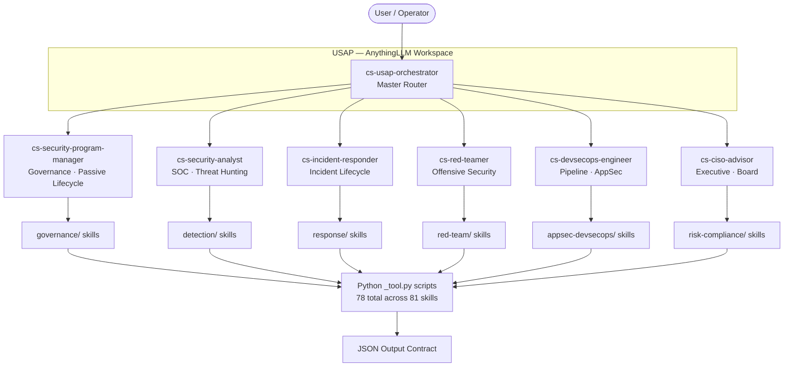

---

## 2. Repository Architecture

### Full Directory Tree

```
usap-skills/
├── agents/                          # 7 cs-* orchestrator agents
│   ├── CLAUDE.md                    # Agent authoring guide (v2 standard)
│   ├── devsecops/
│   │   └── cs-devsecops-engineer.md
│   ├── executive/
│   │   └── cs-ciso-advisor.md
│   ├── governance/
│   │   └── cs-security-program-manager.md
│   └── security/
│       ├── cs-incident-responder.md
│       ├── cs-red-teamer.md
│       └── cs-security-analyst.md
│
├── appsec-devsecops/               # 9 skills — SDLC, SAST/DAST, supply chain
├── cloud-infra/                    # 5 skills — CSPM, IaC, OT/IoT, endpoints
├── detection/                      # 9 skills — hunting, analytics, ASM
├── engineering/                    # 2 skills — code review, architecture
├── governance/                     # 11 skills — posture, roadmap, debt, metrics
├── identity-access/                # 4 skills — IAM, crypto, insider threat
├── platform/                       # 1 skill — SRE runbook
├── platform-ai/                    # 7 skills — AI security, guardrails, orchestration
├── red-team/                       # 7 skills — red team ops, exploitation, attack paths
├── response/                       # 6 skills — incident, containment, forensics
├── risk-compliance/                # 8 skills — risk, compliance, privacy, quantum
│
├── anythingllm-package/            # Auto-generated AnythingLLM plugin package
│   ├── README.md
│   ├── install.sh                  # Copies plugins to AnythingLLM storage
│   ├── setup_workspaces.py         # Creates workspaces via REST API
│   ├── skills/                     # 69 JS plugin wrappers
│   │   └── usap-<slug>/
│   │       ├── plugin.json
│   │       └── handler.js
│   └── workspaces/
│       └── cs-usap-orchestrator.json
│
├── shared/scripts/                 # No-dependency shared utilities
│   ├── cvss_scorer.py              # CVSS v3.1 calculator
│   ├── bb_scope_enforcer.py        # Bug bounty scope validation
│   ├── doc_intake.py               # Multi-format document extractor
│   └── generate_anythingllm_package.py  # Package auto-generator
│
├── standards/
│   ├── frontmatter-spec.md         # All YAML frontmatter fields
│   ├── level-guide.md              # L1–L4 autonomy levels
│   ├── naming-conventions.md       # Slug, file, commit naming rules
│   └── output-contract.md          # Required output JSON schema
│
├── templates/
│   ├── skill-template.md           # Canonical skill template
│   ├── agent-template.md           # Agent development template
│   └── command-template.md         # Command menu template
│
├── domains/                        # Domain index markdown files (one per domain)
├── references/                     # Global reference docs
├── tests/                          # Test suite
├── CONTRIBUTING.md                 # Authoring guide, quality checklist
├── CLAUDE.md                       # AI assistant instructions
└── README.md
```

### Skill Package Internal Structure

Every skill lives inside a domain directory as a named folder with this structure:

```
<domain>/<skill-slug>/
├── SKILL.md                        # LLM system prompt + YAML frontmatter (≤10KB)
├── README.md                       # Human-readable overview
├── references/
│   └── workflow.md                 # Detailed workflow reference
├── assets/templates/
│   └── output-template.json        # Output JSON template
├── expected_outputs/
│   └── sample_output.json          # Validated example output
└── scripts/
    └── <slug>_tool.py              # Python CLI tool (no external deps)
```

---

## 3. Domain Map & Skill Inventory

### Domain Overview

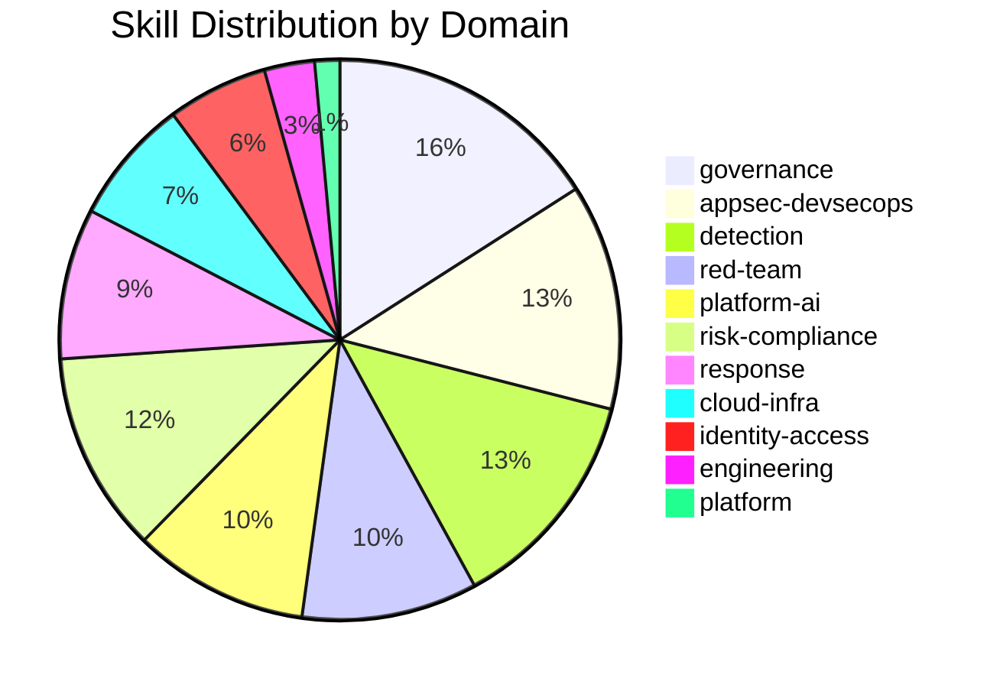

### Complete Skill Inventory

#### appsec-devsecops/ — 9 skills

| Slug | Level | Purpose |
|---|---|---|
| appsec-code-review | L3 | OWASP Top 10, logic flaws, dependency audits on PRs |
| build-integrity | L3 | SLSA L1–L4 provenance, artifact signing verification |
| devsecops-pipeline | L3 | CI/CD posture assessment, pipeline hardening |
| pipeline-security-scan | L3 | Real-time scan gate for CI/CD pipelines |
| sast-dast-coordinator | L3 | Deduplication + triage of SAST/DAST findings |
| secure-sdlc | L2 | Security requirements across SDLC phases |
| security-requirements-review | L2 | Security requirements analysis for design docs |
| supply-chain-risk | L2 | Dependency risk scoring, SBOM generation |
| supply-chain-simulation | L3 | Simulate supply chain compromise scenarios |

#### cloud-infra/ — 5 skills

| Slug | Level | Purpose |
|---|---|---|
| cloud-security-posture | L3 | CSPM findings analysis, misconfiguration detection |
| cloud-workload-protection | L3 | Runtime workload security, container/K8s posture |
| endpoint-os-security | L3 | Endpoint hardening, EDR gap analysis |
| iac-security | L3 | Terraform/CloudFormation security analysis |
| ot-iot-device-security | L3 | OT/IoT device inventory and threat modeling |

#### detection/ — 9 skills

| Slug | Level | Purpose |
|---|---|---|
| attack-surface-management | L3 | External attack surface enumeration and drift |
| behavioral-analytics | L3 | UBA/UEBA, entity baseline deviation detection |
| deception-honeypot | L3 | Honeypot placement strategy and alert triage |
| detection-engineering | L3 | SIEM rule development, detection logic review |
| network-exposure | L3 | Network exposure mapping, service visibility |
| secrets-exposure | L3 | Secret scanning, leaked credential analysis |
| telemetry-signal-quality | L3 | Log/telemetry quality scoring, gap detection |
| threat-hunting | L3 | Hypothesis-driven hunt execution across telemetry |
| threat-intelligence | L3 | TI enrichment, IOC correlation, actor attribution |

#### engineering/ — 2 skills

| Slug | Level | Purpose |
|---|---|---|
| architecture-advisor | L2 | Security architecture review and recommendations |
| code-reviewer | L3 | General security code review |

#### governance/ — 11 skills

| Slug | Level | Purpose |
|---|---|---|
| ciso-brief-generator | L2 | Board/executive-ready security posture briefs |
| findings-tracker | L3 | Centralized finding aggregation and aging |
| knowledge-management | L2 | Security knowledge base maintenance |
| metrics-reporting | L2 | KPI dashboards, trend analysis, SLA tracking |
| security-architecture | L2 | Enterprise security architecture assessment |
| security-awareness | L2 | Awareness program design and measurement |
| security-debt-tracker | L3 | Finding aging, SLA breach, debt classification |
| security-policy-control | L2 | Policy gap analysis, control mapping |
| security-posture-score | L2 | 0–100 composite posture score (7 domain weights) |
| security-roadmap-planner | L2 | 12-month investment-prioritized roadmap |
| vulnerability-management | L3 | Vulnerability lifecycle: ingest → prioritize → remediate |

#### identity-access/ — 4 skills

| Slug | Level | Purpose |
|---|---|---|
| cryptography-key-management | L3 | Key lifecycle, algorithm assessment, rotation |
| data-security-classification | L2 | Data inventory, classification, DLP gap analysis |
| identity-access-risk | L3 | IAM risk scoring, privilege analysis |
| insider-physical-risk | L3 | Insider threat indicators, physical access risk |

#### platform-ai/ — 7 skills

| Slug | Level | Purpose |
|---|---|---|
| agent-integrity-monitor | L3 | AI agent behavior monitoring, integrity checks |
| ai-agent-security | L2 | AI agent security review, prompt injection defense |
| ai-ethics-governance | L2 | AI ethics review, bias and fairness assessment |
| guardrail | L3 | LLM output guardrail enforcement |
| orchestrator | L3 | Multi-agent orchestration coordination |
| third-party-vendor-risk | L2 | Vendor security risk assessment |
| tool-execution-broker | L4 | Tool call authorization and execution control |

#### red-team/ — 7 skills

| Slug | Level | Purpose |
|---|---|---|
| ai-red-teaming | L3 | AI system adversarial testing |
| attack-path-analysis | L3 | Crown jewel attack path mapping |
| continuous-pentesting | L3 | Ongoing automated penetration testing |
| red-team-operations | L4 | Tactical red team operation execution |
| red-team-planner | L2 | Red team engagement scoping and planning |
| safe-exploitation | L4 | Controlled, RoE-bound exploitation |
| security-research | L3 | Vulnerability research and disclosure |

#### response/ — 6 skills

| Slug | Level | Purpose |
|---|---|---|
| containment-advisor | L3 | Containment strategy, isolation recommendations |
| forensics | L3 | DFRWS forensic collection, chain of custody |
| incident-classification | L3 | SEV1–4 classification, regulatory clock start |
| incident-commander | L2 | Incident lifecycle coordination |
| zero-day-response | L4 | Zero-day response with vendor coordination |
| zero-day-response-governance | L2 | Zero-day governance, disclosure decision |

#### risk-compliance/ — 8 skills

| Slug | Level | Purpose |
|---|---|---|
| compliance-mapping | L2 | NIST/ISO/SOC2/PCI control gap mapping |
| cyber-insurance | L1 | Insurance program design, coverage assessment |
| enterprise-risk-assessment | L2 | Enterprise risk quantification, ALE calculation |
| internal-audit-assurance | L2 | Internal audit coordination, control testing |
| privacy-dpia | L2 | DPIA/PIA for GDPR/CCPA compliance |
| quantum-security-readiness | L2 | PQC readiness assessment, crypto migration |
| regulatory-horizon | L2 | Emerging regulation monitoring and gap analysis |
| risk-threat-modeling | L2 | STRIDE/PASTA threat modeling, risk scoring |

---

## 4. Orchestrator Agent Catalogue

### Agent Comparison Matrix

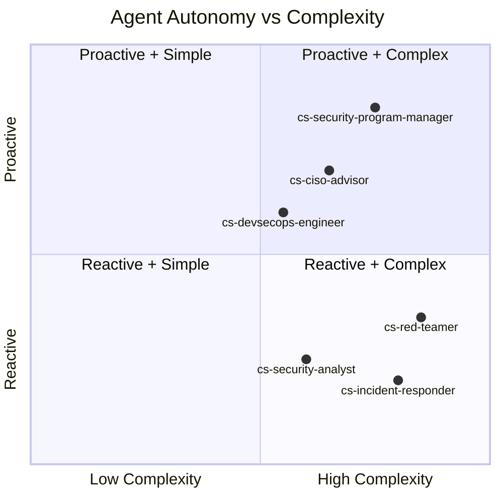

### Agent Detail

#### cs-security-program-manager

```
Location:    agents/governance/cs-security-program-manager.md
Persona:     Jordan — 14 yrs F500 security programs, $40M+ budgets
Model:       sonnet
Mode:        Passive (scheduled, program-driven)
Trigger:     User-initiated: PL, SC, FR codes OR natural language
```

**Skills Orchestrated:**
security-roadmap-planner, security-debt-tracker, security-posture-score, vulnerability-management, attack-surface-management, findings-tracker, metrics-reporting, ciso-brief-generator, enterprise-risk-assessment, compliance-mapping, behavioral-analytics, security-requirements-review, risk-threat-modeling, security-architecture

**Workflows:**

| Code | Name | Description | Output |
|---|---|---|---|
| PL | Program Planning | 12-month investment-prioritized roadmap from posture + risk + compliance data | Roadmap, investment priorities, quarterly milestones |
| SC | Proactive Security Scan | Scheduled sweep for emerging gaps, aging findings, attack surface drift | Digest with findings, severity, routing decisions |
| FR | Facilitated Review | Threat modeling, architecture review, risk committee, scenario analysis | Decision Record, action items, risk register update |

**Routing authority:** When SC produces Critical/High findings confirmed by ≥2 passive signals, routes to cs-security-analyst (for detection gaps) or cs-incident-responder (for active threat indicators).

---

#### cs-security-analyst

```
Location:    agents/security/cs-security-analyst.md
Persona:     Alex — 12 yrs SOC/CERT/MSSP, led nation-state IR teams
Model:       sonnet
Mode:        Reactive (alert-triggered)
Trigger:     Alert ingestion, threat hunt initiation, compromise assessment request
```

**Skills Orchestrated:**
threat-hunting, behavioral-analytics, secrets-exposure, incident-classification, telemetry-signal-quality, threat-intelligence

**Workflows:**

| Code | Name | SLA | Output |
|---|---|---|---|
| AT | Alert Triage | <15 min classification | Severity, confidence, action recommendation |
| TH | Threat Hunt | Full hypothesis cycle | Hunt report, IOC package, next_agents |
| CA | Compromise Assessment | <1 hr verdict | Compromise verdict with evidence chain |
| DI | Document Intake | Pre-alert | SecurityFact JSON for downstream AT |

**Corroboration rule:** Never escalate on single-source observation. Minimum 2 independent data sources before SEV escalation.

---

#### cs-incident-responder

```
Location:    agents/security/cs-incident-responder.md
Persona:     Jordan — 14 yrs IR, 200+ ransomware responses, ICS-model IR playbook author
Model:       opus
Mode:        Reactive (incident-triggered)
Trigger:     SEV declaration, cs-security-analyst escalation, direct incident report
```

**Skills Orchestrated:**
incident-commander, incident-classification, containment-advisor, forensics, zero-day-response

**Workflows:**

| Code | Name | Key Gate | Output |
|---|---|---|---|
| IT | Initial Triage & SEV Declaration | Confidence ≥0.7 → SEV1; 0.5–0.7 → SEV2+ with caveat | SEV level, regulatory clock, stakeholder list |
| CO | Active Containment | Human approval required for all isolation actions | Containment record, evidence preservation log |
| FO | Forensic Collection & PIR | Chain-of-custody established before collection | Forensic package, dwell time, PIR report |

**Severity thresholds:**

```
Confidence ≥ 0.7  →  SEV1 — immediate escalation
Confidence 0.5–0.7 →  SEV2+ with uncertainty flagged
Confidence < 0.5  →  Inconclusive — additional collection required
```

---

#### cs-red-teamer

```
Location:    agents/security/cs-red-teamer.md
Persona:     Sam — 10 yrs offensive security, MITRE ATT&CK contributor
Model:       opus
Mode:        Proactive (scoped engagement)
Trigger:     Written Rules of Engagement (RoE) — AUTHORIZATION REQUIRED
```

**Skills Orchestrated:**
red-team-planner, red-team-operations, safe-exploitation, attack-path-analysis, continuous-pentesting, ai-red-teaming

**Workflows:**

| Code | Name | Authorization Gate | Output |
|---|---|---|---|
| ES | Engagement Scoping | Validates written RoE FIRST — blocks all execution without it | Scope document, objectives, phase plan |
| AP | Attack Path Mapping | RoE-bound | Attack graph, crown jewel paths, blast radius |
| FR | Findings Report | Post-engagement | Dual-track report (technical + executive) |

**Hard stop:** No operation executes without explicit written authorization. Authorization check is Step 0 of every workflow.

---

#### cs-devsecops-engineer

```
Location:    agents/devsecops/cs-devsecops-engineer.md
Persona:     Riley — 11 yrs pipeline security, 10,000+ PRs/day hyperscaler, SBOM/SLSA specialist
Model:       sonnet
Mode:        Pipeline-triggered (PR gate, scheduled pipeline hardening)
Trigger:     PR submission, pipeline scan event, SBOM generation request
```

**Skills Orchestrated:**
secure-sdlc, sast-dast-coordinator, devsecops-pipeline, build-integrity, supply-chain-risk, appsec-code-review, pipeline-security-scan, security-requirements-review

**Workflows:**

| Code | Name | SLA | Output |
|---|---|---|---|
| PR | PR Security Gate | <5 min (PR gate) / <30 s (pre-commit) | PASS/FAIL with fix paths |
| RS | Pipeline Hardening Assessment | Async | Hardening report, control gaps |
| PA | SBOM + Dependency Audit | Pre-release | SBOM, risk score, blocked components |
| DR | Document Security Review | BMAD 3-step | Security requirements findings (no false positives) |

**Developer empathy:** Fix-path provided before blocking. Gates designed for velocity: pre-commit <30s, PR gate <5 min.

**BMAD pattern (DR workflow):**
1. `doc_intake.py` — extract text from PDF/DOCX/HTML
2. `pre_analysis.py` — classify document type, extract entities
3. `security-requirements-review_tool.py` — structured findings
> No downstream routing until Step 3 completes. Prevents false positives from partial analysis.

---

#### cs-ciso-advisor

```
Location:    agents/executive/cs-ciso-advisor.md
Persona:     Morgan — 16 yrs as CISO, 30+ audit committee presentations, cyber risk governance professor
Model:       opus
Mode:        Scheduled (quarterly board cycle, ad-hoc executive requests)
Trigger:     Board report cycle, risk posture review, regulatory gap request
```

**Skills Orchestrated:**
enterprise-risk-assessment, compliance-mapping, metrics-reporting, security-posture-score, ciso-brief-generator, cyber-insurance

**Workflows:**

| Code | Name | Audience | Output |
|---|---|---|---|
| BR | Board Report | Board / Audit Committee | Quarterly posture report (financially anchored) |
| RP | Risk Posture Review | Executive leadership | Risk register, ALE analysis, top-10 risks |
| RG | Regulatory Gap Assessment | Compliance / Legal | Gap inventory, 90-day remediation roadmap |

**Communication standard:** ALE-first (Annual Loss Expectancy). Every risk framed in financial impact, not severity score alone.

---

## 5. Passive vs Reactive Architecture

### Ownership Map

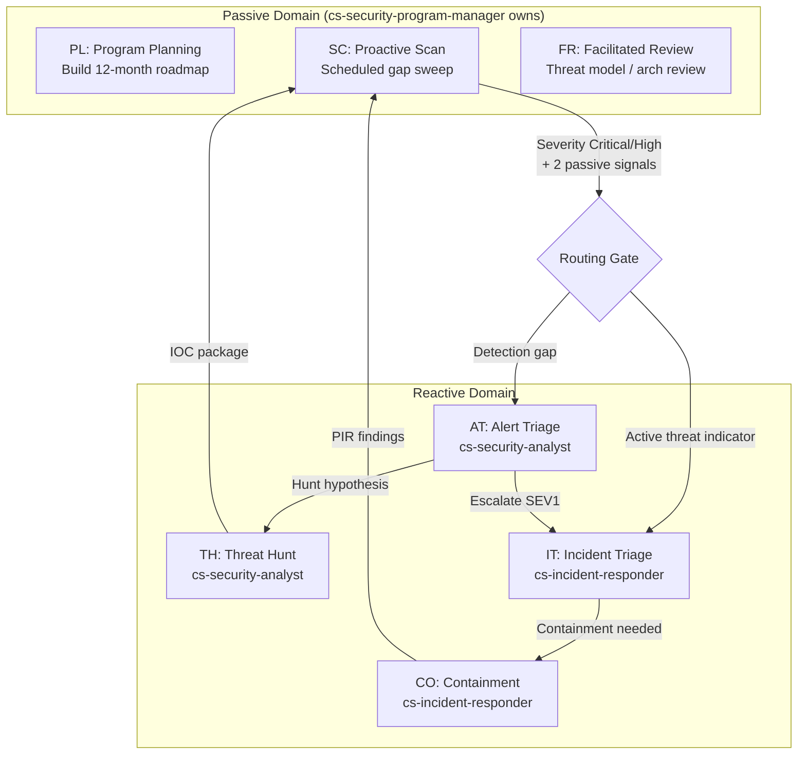

### Routing Rules

| Condition | Action | Owner |
|---|---|---|
| SC finds Critical finding + 2 passive signals confirm | Route to cs-security-analyst (AT) | cs-security-program-manager |
| SC finds active threat indicators | Route to cs-incident-responder (IT) | cs-security-program-manager |
| AT produces SEV1 (confidence ≥0.7) | Escalate to cs-incident-responder | cs-security-analyst |
| IT completes PIR | Feed PIR data to next SC scan | cs-incident-responder |
| Reactive agent produces hunt hypothesis | Return TH package to program manager | cs-security-analyst |

### What Reactive Agents Must NEVER Do

- Self-initiate passive workflows (program planning, proactive scans, facilitated reviews)
- Create roadmap items without posture data grounding
- Close incident without PIR (post-incident review)
- Escalate on single-source observation (< 2 corroborating sources)

---

## 6. Skill Package Specification

### SKILL.md Frontmatter — Canonical Format

```yaml
---
name: <slug>                         # Must match directory name
description: "USAP agent skill for <Title>. Use for <one-line purpose>."
license: MIT
metadata:
  version: 1.0.0
  author: USAP Team
  category: usap-governance          # see categories below
  updated: YYYY-MM-DD
  agent_slug: "<slug>"               # Quoted; must match name exactly (3 places)
  agent_id: <integer>                # Unique; next available = 50
  level: L3                          # L1 / L2 / L3 / L4
  plane: work                        # work / governance / board
  phase: phase3                      # mvp / phase1 / phase2 / phase3
  ttl: 7d                            # Time-to-live for cached results
  approval_required: false           # true for mutating skills
  mutating_intents: []               # List of mutation types if applicable
  can_execute: false                 # true for L4 skills with tool execution
  providers: [internal]              # anythingllm / ollama / mock / internal
  required_invoke_role: security-analyst
  required_approver_role: security-manager
  input_schema: findings_list
  output_schema: debt_summary, debt_buckets, accumulation_rate
  runtime_contract: ../../agents/<slug>.yaml
---
```

### Allowed Categories

| Category | Domain |
|---|---|
| usap-governance | governance/ |
| usap-detection | detection/ |
| usap-response | response/ |
| usap-devsecops | appsec-devsecops/ |
| usap-red-team | red-team/ |
| usap-operations | detection/ cloud-infra/ platform-ai/ |
| usap-engineering | engineering/ |
| usap-executive | governance/ risk-compliance/ |

### Skill Levels

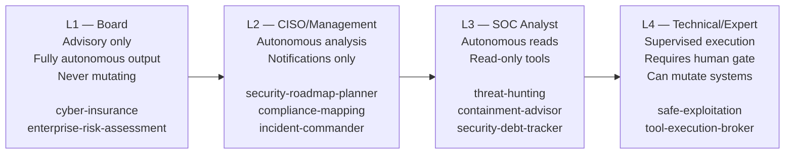

### SKILL.md Required Sections (in order)

1. Identity block (name, level, category, capabilities statement)
2. Classification/decision table with MITRE ATT&CK mappings
3. Numbered Reasoning Procedure (step-by-step)
4. Intent Classification rule (explicit mapping to intent_type)
5. Proactive Triggers (4–6 entries for when to self-invoke)
6. Context Discovery (what to auto-find in workspace)
7. Output Artifacts table (3–6 rows: artifact, format, consumer)
8. Related Skills (include NOT scenarios)
9. References

---

## 7. Output Contract

### Required Fields (all 11 must be present)

```json
{
  "agent_slug": "threat-hunting",
  "intent_type": "detect",
  "action": "Escalate to incident-responder — confirmed lateral movement detected",
  "rationale": "EDR shows 3 lateral movement events + SIEM confirms anomalous auth from same host within 2-hour window",
  "confidence": 0.87,
  "severity": "critical",
  "key_findings": [
    "Lateral movement: host-A → host-B → DC-01 (MITRE T1021.002)",
    "Auth anomaly: 47 failed + 1 success from non-baseline source IP",
    "EDR alert: process injection on host-B (T1055)"
  ],
  "evidence_references": [
    { "source": "EDR", "event_id": "12345", "timestamp_utc": "2026-03-10T14:22:00Z" },
    { "source": "SIEM", "rule": "AUTH_ANOMALY_001", "timestamp_utc": "2026-03-10T14:24:00Z" }
  ],
  "next_agents": ["incident-classification", "containment-advisor"],
  "human_approval_required": false,
  "timestamp_utc": "2026-03-10T14:30:00Z"
}
```

### Optional Fields

| Field | Type | When Used |
|---|---|---|
| mitre_ttps | array[string] | Detection/red-team skills |
| cvss_score | float | Vulnerability skills |
| epss_score | float | Vulnerability skills with exploitation probability |
| risk_score | int (0–100) | Risk/compliance skills |
| affected_assets | array[string] | Response/containment skills |
| remediation_steps | array[string] | Advisory skills |
| regulatory_flags | array[string] | Compliance skills |
| escalation_reason | string | When escalating to human |
| communication_standard_applied | boolean | When using 5-part format |

### Communication Standard (Human-Facing Output)

All skills that surface findings to humans must structure output using:

```
BOTTOM LINE: [one sentence verdict — ALWAYS FIRST]

WHAT: [findings with confidence tag]
  - [finding 1] [verified / medium confidence / assumed]
  - [finding 2] [verified]
  ...max 5 bullets

WHY THIS MATTERS: [business/security impact, 1–3 sentences]

HOW TO ACT: [action → owner role → urgency]
  - [action] → [role] → [by when]

YOUR DECISION: [Option A vs B with trade-offs]  ← if decision needed
```

### Severity Thresholds

| Severity | Confidence Requirement | evidence_references Required | Human Gate |
|---|---|---|---|
| critical | ≥0.7 | Yes | Optional |
| high | ≥0.6 | Yes | Optional |
| medium | ≥0.5 | Recommended | No |
| low | Any | No | No |
| informational | Any | No | No |

---

## 8. AnythingLLM Integration

### Architecture

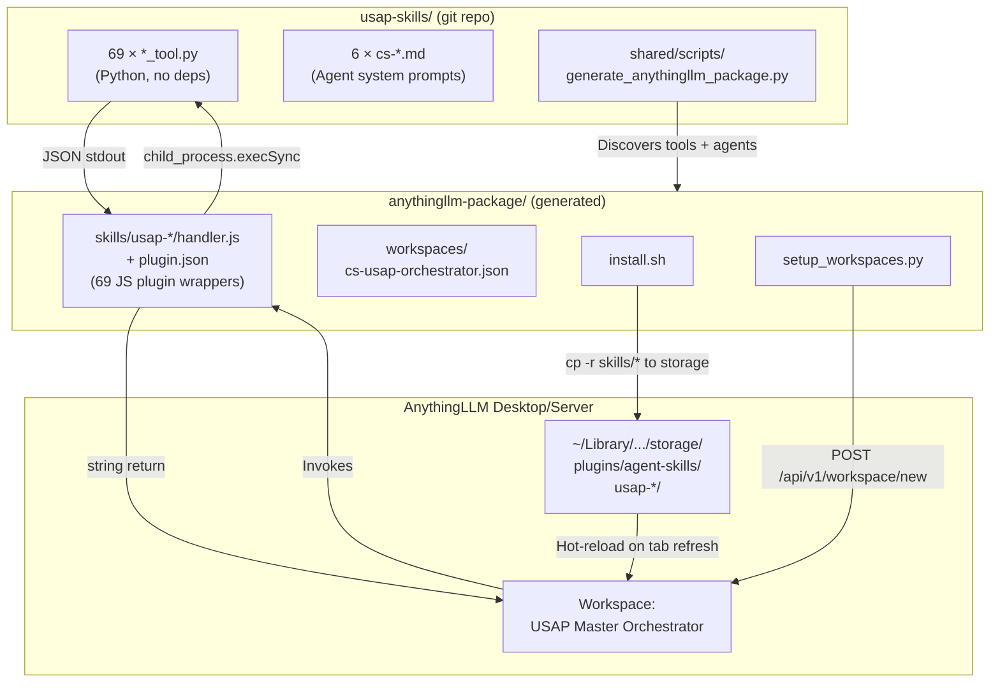

### Plugin Structure (per skill)

#### plugin.json

```json
{
  "active": true,
  "name": "USAP: Security Debt Tracker",
  "hubId": "usap-security-debt-tracker",
  "schema": "skill-1.0.0",
  "version": "1.0.0",
  "description": "USAP agent skill for Security Debt Tracking...",
  "author": "USAP Team",
  "license": "MIT",
  "entrypoint": {
    "file": "handler.js",
    "params": {
      "input": {
        "description": "JSON input for the skill",
        "type": "string",
        "required": false
      }
    }
  },
  "setup_args": {
    "USAP_REPO_PATH": {
      "type": "string",
      "required": true,
      "input": {
        "label": "USAP repo path",
        "description": "Absolute path to your usap-skills repo",
        "placeholder": "/Users/you/usap-skills"
      }
    }
  }
}
```

#### handler.js — Security Model

```javascript
// Input path: written to temp file → passed as --input flag → temp file deleted
// Prevents shell injection from LLM-generated input strings

const tmpFile = path.join(os.tmpdir(), `usap_input_${Date.now()}.json`);
try {
  JSON.parse(input);                           // validate JSON first
  fs.writeFileSync(tmpFile, input, 'utf-8');   // write to temp
  result = execSync(
    `python3 "${toolPath}" --input "${tmpFile}" --output json`,
    { encoding: 'utf-8', timeout: 30000, cwd: repoPath }
  ).trim();
} finally {
  if (fs.existsSync(tmpFile)) fs.unlinkSync(tmpFile);  // always clean up
}
```

### Master Orchestrator Workspace

```json
{
  "slug": "cs-usap-orchestrator",
  "name": "USAP Master Orchestrator",
  "system_prompt": "...",   // 22,864 chars — routing table + all 6 agent personas
  "chat_mode": "chat",
  "agent_skills": [         // all 69 usap-* skills
    "usap-appsec-code-review",
    "usap-attack-surface-management",
    "..."
  ],
  "subordinate_agents": [
    "cs-devsecops-engineer",
    "cs-ciso-advisor",
    "cs-security-program-manager",
    "cs-incident-responder",
    "cs-red-teamer",
    "cs-security-analyst"
  ]
}
```

### API Endpoints Used

| Operation | Method | Endpoint |
|---|---|---|
| Auth check | GET | `/api/v1/auth` |
| Create workspace | POST | `/api/v1/workspace/new` |
| Update workspace | POST | `/api/v1/workspace/:slug/update` |
| Delete workspace | DELETE | `/api/v1/workspace/:slug` |
| Get workspace | GET | `/api/v1/workspace/:slug` |

### Installation Paths by Platform

| Platform | Storage Path |
|---|---|
| macOS Desktop | `~/Library/Application Support/anythingllm-desktop/storage/plugins/agent-skills/` |
| Docker/Server | `/app/server/storage/plugins/agent-skills/` |
| Linux | `~/.config/anythingllm/storage/plugins/agent-skills/` |
| Override | `ANYTHINGLLM_STORAGE=/custom/path bash install.sh` |

---

## 9. Data Flow Diagrams

### End-to-End Alert Triage Flow

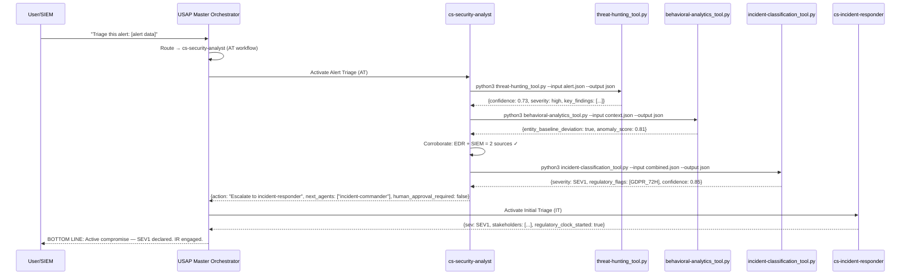

### Security Program Planning Flow

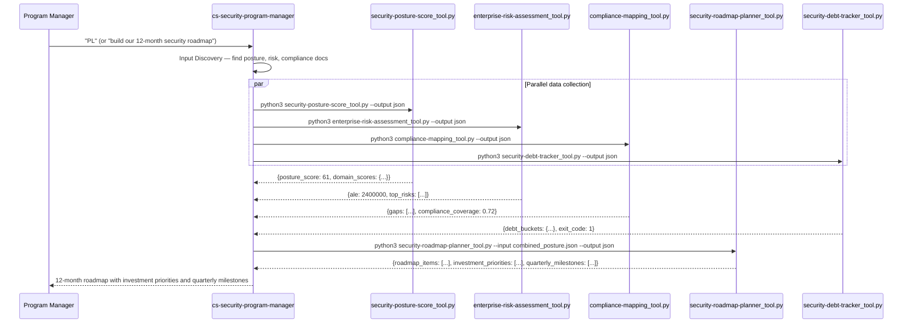

### PR Security Gate Flow

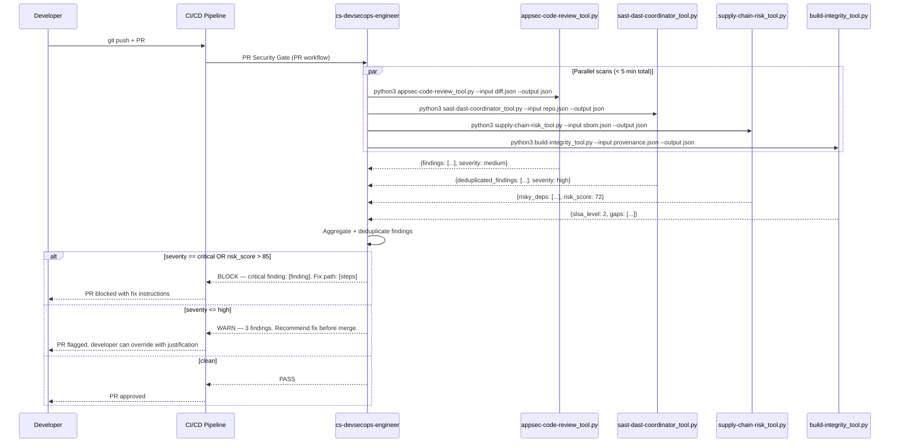

### AnythingLLM Skill Execution Flow

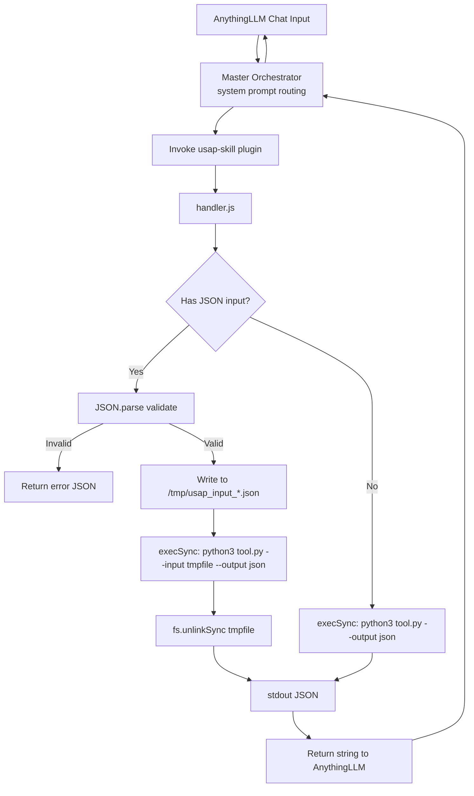

---

## 10. Workflow Reference

### Command Menu (all agents)

Every agent recognizes these codes:

| Code | Global | Description |
|---|---|---|
| HE | All agents | Print help — list all workflows and codes |
| ST | All agents | Show current workflow state |

| Code | Agent | Workflow |
|---|---|---|
| PL | cs-security-program-manager | Program Planning — 12-month roadmap |
| SC | cs-security-program-manager | Proactive Security Scan |
| FR | cs-security-program-manager | Facilitated Security Review |
| AT | cs-security-analyst | Alert Triage |
| TH | cs-security-analyst | Threat Hunt Execution |
| CA | cs-security-analyst | Compromise Assessment |
| DI | cs-security-analyst | Document Intake |
| IT | cs-incident-responder | Initial Triage & SEV Declaration |
| CO | cs-incident-responder | Active Containment |
| FO | cs-incident-responder | Forensic Collection & PIR |
| ES | cs-red-teamer | Engagement Scoping |
| AP | cs-red-teamer | Attack Path Mapping |
| FR | cs-red-teamer | Findings Report |
| PR | cs-devsecops-engineer | PR Security Gate |
| RS | cs-devsecops-engineer | Pipeline Hardening Assessment |
| PA | cs-devsecops-engineer | SBOM + Dependency Audit |
| DR | cs-devsecops-engineer | Document Security Review |
| BR | cs-ciso-advisor | Board Report Generation |
| RP | cs-ciso-advisor | Risk Posture Review |
| RG | cs-ciso-advisor | Regulatory Gap Assessment |

### Workflow Block Requirements (Agent v2 Standard)

Every workflow definition in a cs-* agent file must include:

```markdown
### [WF Code] — Workflow Name

**MANDATORY EXECUTION RULES:**
- Rule 1
- Rule 2

**FAILURE MODES:**
- Failure condition → fallback action

[numbered workflow steps]

**SUCCESS CRITERIA:**
- Measurable outcome 1
- Measurable outcome 2

**FAILURE INDICATORS:**
- What constitutes a failed execution
```

---

## 11. Quality Standards

### 18-Point Pre-Submission Checklist

| # | Check | Fail Action |
|---|---|---|
| 1 | Frontmatter uses canonical format | Reformat |
| 2 | agent_slug matches directory name in 3 places | Fix all 3 |
| 3 | Runtime Contract line present | Add it |
| 4 | Classification tables with MITRE ATT&CK | Add mappings |
| 5 | Numbered Reasoning Procedure | Add numbered steps |
| 6 | Intent Classification rule explicit | Add rule |
| 7 | README.md has real content | Replace template |
| 8 | references/workflow.md has actual workflow | Write it |
| 9 | sample_output.json validates against contract | Fix schema |
| 10 | No paid API keys or offensive techniques | Remove them |
| 11 | SKILL.md ≤10KB | Move excess to references/ |
| 12 | Proactive Triggers section (4–6 entries) | Add it |
| 13 | Output Artifacts table (3–6 rows) | Add it |
| 14 | Related Skills entries include NOT-scenarios | Add negatives |
| 15 | Context Discovery section present | Add it |
| 16 | Tool runs zero-config: `python scripts/<slug>_tool.py --output json` | Fix tool |
| 17 | Tool has --help (argparse required) | Add argparse |
| 18 | Scoring tools include risk_score (0–100) + confidence (float) | Add fields |

### Agent v2 Required Sections

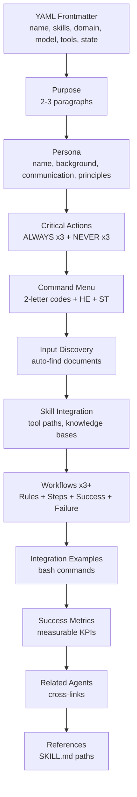

---

## 12. Naming Conventions

### Skill Slugs

| Rule | Example |
|---|---|
| lowercase-hyphenated | `threat-hunting` NOT `ThreatHunting` |
| max 4 words | `security-debt-tracker` NOT `usap-security-debt-tracking-system` |
| no version suffixes | `threat-hunting` NOT `threat-hunting-v2` |
| no underscores | `appsec-code-review` NOT `appsec_code_review` |

### File Naming

| File Type | Convention | Example |
|---|---|---|
| Tool script | `<slug>_tool.py` | `security-debt-tracker_tool.py` |
| Agent file | `cs-<name>.md` | `cs-security-analyst.md` |
| Domain dir | `lowercase-hyphenated/` | `appsec-devsecops/` |
| AnythingLLM plugin | `usap-<slug>/` | `usap-threat-hunting/` |

### Commit Messages (Conventional Commits)

```
feat(skills): add quantum-security-readiness skill to risk-compliance domain
fix(scripts): correct CVSS scoring edge case for AV:P vectors
docs(readme): update domain count to reflect new engineering/ domain
refactor(structure): move sre-runbook-advisor to platform/ domain
chore: update .gitignore to exclude anythingllm-package/skills/
```

---

## 13. Metrics & Thresholds

### Governance KPIs

| Metric | Target | Alert Threshold |
|---|---|---|
| MTTD (Mean Time to Detect) | <24h Critical | >48h = breach |
| MTTR (Mean Time to Respond) | <4h Critical | >8h = breach |
| Patch coverage — Critical CVEs | >95% in 15d | <85% = SLA breach |
| SLA compliance overall | >90% | <80% = escalate |
| Phishing click rate | <5% | >10% = immediate training |
| Training completion | >95% quarterly | <90% = program gap |
| Security posture score | >75/100 | <60 = roadmap priority |
| Architecture control coverage | >85% | <70% = gap analysis |

### Vulnerability SLA Bands (CVSS + EPSS)

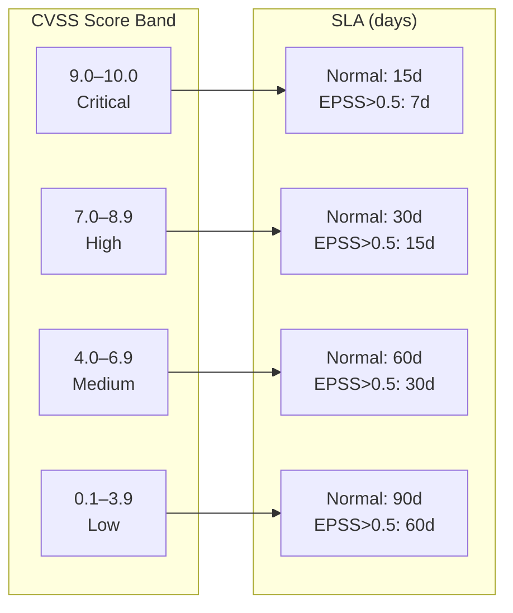

### Security Posture Score Composition

The `security-posture-score` skill produces a 0–100 composite from 7 domain weights:

| Domain | Weight | Sub-factors |
|---|---|---|
| Vulnerability Management | 25% | CVSS distribution, SLA compliance, patch velocity |
| Identity & Access | 20% | MFA coverage, privileged account ratio, access review freshness |
| Detection & Response | 20% | MTTD, MTTR, telemetry coverage, hunt frequency |
| Cloud & Infrastructure | 15% | CSPM score, IaC coverage, misconfiguration count |
| AppSec & SDLC | 10% | SAST/DAST coverage, dependency hygiene, SLSA level |
| Governance & Policy | 5% | Policy coverage, training completion, audit finding age |
| Data & Compliance | 5% | Classification coverage, regulatory gap score |

### Confidence Thresholds

| Confidence | Interpretation | Action |
|---|---|---|
| ≥0.85 | High confidence | Act immediately, no caveat needed |
| 0.70–0.84 | Confident | Escalate; brief caveat on remaining uncertainty |
| 0.50–0.69 | Moderate | Escalate with uncertainty flag; collect more data |
| <0.50 | Inconclusive | Do NOT escalate; collect additional evidence first |

### Security Debt Tracker Exit Codes

| Exit Code | Status | Meaning |
|---|---|---|
| 0 | Stable | Debt within acceptable bounds, SLA compliance maintained |
| 1 | Accumulating | Overdue items increasing; roadmap attention required |
| 2 | Critical | Critical debt level; immediate program intervention required |

---

## 14. Deployment Runbook

### Initial Setup

```bash
# 1. Clone the repo
git clone https://github.com/jaskaranhundal/usap-skills
cd usap-skills

# 2. Generate the AnythingLLM package
python3 shared/scripts/generate_anythingllm_package.py
# Output: anythingllm-package/ with 69 skills + 1 workspace

# 3. Validate all plugin.json files
python3 -c "
import json, glob
files = glob.glob('anythingllm-package/skills/*/plugin.json')
[json.load(open(f)) for f in files]
print(f'All {len(files)} plugin.json valid')
"

# 4. Install skill plugins
bash anythingllm-package/install.sh
# Copies usap-* skill folders to ~/Library/Application Support/anythingllm-desktop/storage/plugins/agent-skills/

# 5. Reload AnythingLLM (browser tab reload or app restart)

# 6. Configure USAP_REPO_PATH
# In AnythingLLM: Settings → Agent Skills → each usap-* skill → set USAP_REPO_PATH

# 7. Create the workspace
python3 anythingllm-package/setup_workspaces.py \
  --api-key <your-api-key> \
  --url http://localhost:3001
# Output: workspace 'usap-master-orchestrator' created with 69 skills
```

### Verifying the Deployment

```bash
# Check API auth
curl -s http://localhost:3001/api/v1/auth \
  -H 'Authorization: Bearer <api-key>' | python3 -m json.tool

# Verify workspace created
curl -s http://localhost:3001/api/v1/workspace/usap-master-orchestrator \
  -H 'Authorization: Bearer <api-key>' | python3 -c "
import json, sys
d = json.load(sys.stdin)
w = d['workspace'][0]
print('Name:', w['name'])
print('Prompt chars:', len(w.get('openAiPrompt','')))
print('Created:', w['createdAt'])
"

# Count installed skills
ls ~/Library/Application\ Support/anythingllm-desktop/storage/plugins/agent-skills/ \
  | grep usap | wc -l
# Expected: 69

# Test skill tool directly
python3 governance/security-debt-tracker/scripts/security-debt-tracker_tool.py --output json
python3 detection/threat-hunting/scripts/threat-hunting_tool.py --output json
```

### Regenerating the Package (after skill updates)

```bash
# Regenerate all plugins + workspace
python3 shared/scripts/generate_anythingllm_package.py

# Reinstall skills
bash anythingllm-package/install.sh

# Rebuild workspace (delete old first)
curl -X DELETE http://localhost:3001/api/v1/workspace/usap-master-orchestrator \
  -H 'Authorization: Bearer <api-key>'

python3 anythingllm-package/setup_workspaces.py \
  --api-key <api-key> --url http://localhost:3001
```

### Adding a New Skill

```bash
# 1. Find next agent_id
grep -r "^  agent_id:" */*/SKILL.md | awk -F': ' '{print $2}' | sort -n | tail -1
# Currently: 49 → next = 50

# 2. Scaffold the skill package
cp -r templates/skill-template.md <domain>/<slug>/SKILL.md
mkdir -p <domain>/<slug>/{references,assets/templates,expected_outputs,scripts}

# 3. Fill in SKILL.md (frontmatter + 9 required sections)

# 4. Create scripts/<slug>_tool.py (argparse --input --output json --help)

# 5. Test the tool
python3 <domain>/<slug>/scripts/<slug>_tool.py --output json

# 6. Run 18-point quality checklist (see CONTRIBUTING.md)

# 7. Regenerate AnythingLLM package
python3 shared/scripts/generate_anythingllm_package.py

# 8. Commit
git add <domain>/<slug>/
git commit -m "feat(skills): add <slug> to <domain> domain"
```

### Adding a New cs-* Agent

```bash
# 1. Copy template
cp templates/agent-template.md agents/<domain>/cs-<name>.md

# 2. Fill in YAML frontmatter (cs- prefix required)
# 3. Write 12 required sections (v2 standard)
# 4. Include Command Menu with 2-letter workflow codes
# 5. Minimum 3 workflows with MANDATORY RULES + FAILURE MODES + SUCCESS CRITERIA

# 6. Update agents/CLAUDE.md agent catalog
# 7. Update root README.md agents table

# 8. Commit
git commit -m "feat(agents): add cs-<name> agent to <domain> domain"
```

### Shared Utilities Reference

```bash
# CVSS v3.1 scorer (no deps)
python3 shared/scripts/cvss_scorer.py \
  --vector "CVSS:3.1/AV:N/AC:L/PR:N/UI:N/S:C/C:H/I:H/A:H"

# Bug bounty scope enforcer (no deps)
python3 shared/scripts/bb_scope_enforcer.py \
  --target example.com \
  --scope-file scope.json

# Document intake (multi-format text extraction)
python3 shared/scripts/doc_intake.py \
  --input report.pdf \
  --output json
```

---

*End of Technical Reference — USAP v2.0*

*Generated: 2026-03-10 | Skills: 69 | Agents: 6 | AnythingLLM workspace: cs-usap-orchestrator*
